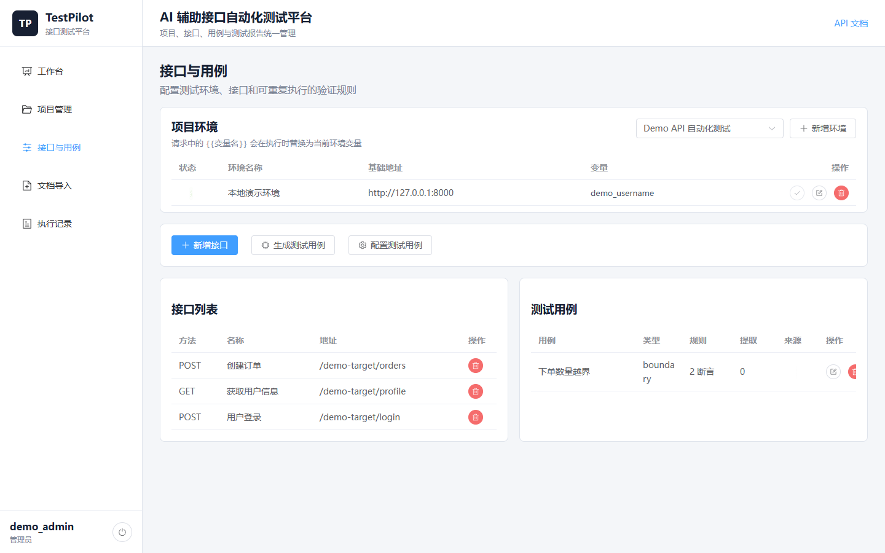
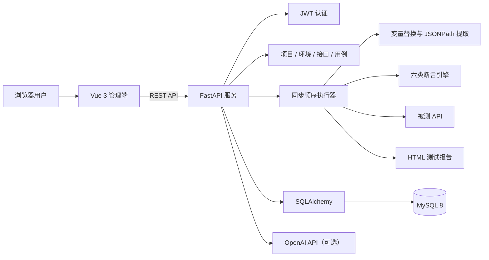
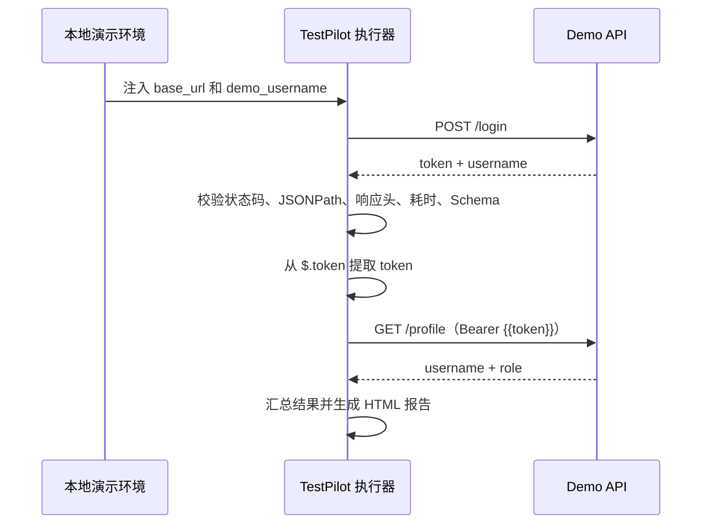
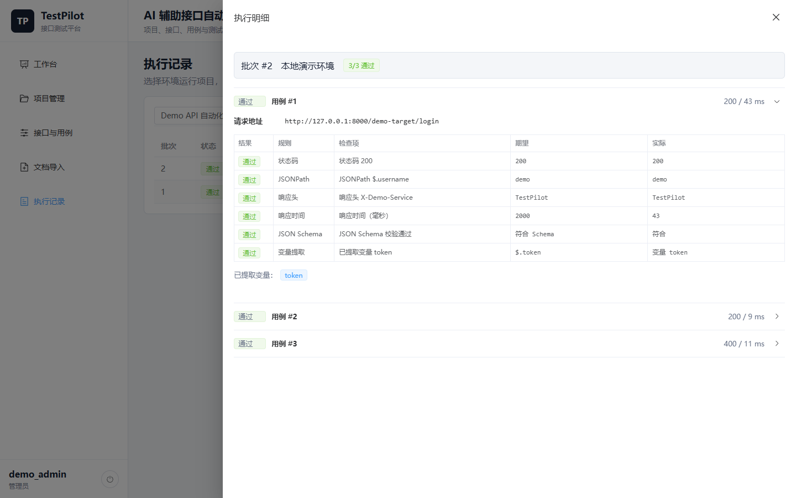
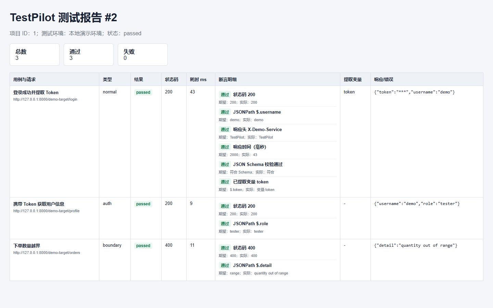
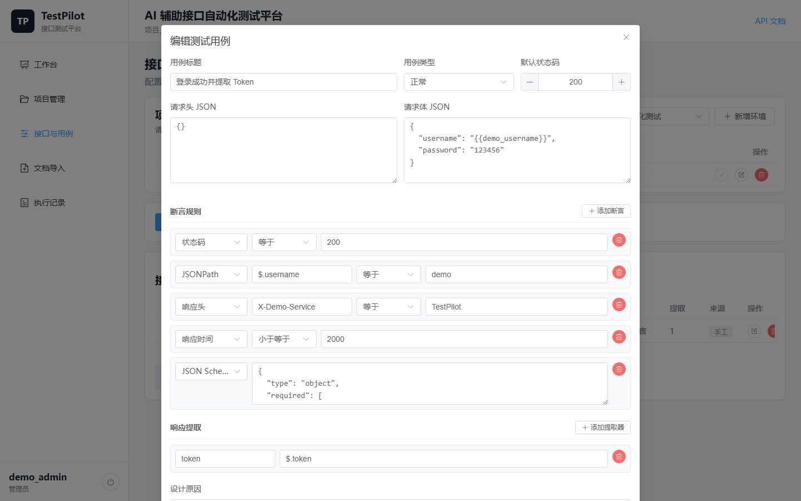

# TestPilot

TestPilot 是一个面向接口测试全流程的 AI 辅助自动化测试平台。平台统一管理项目、环境、接口、用例、执行记录和 HTML 报告，支持多种断言、JSONPath 变量提取及跨接口参数传递。



## 核心能力

- **接口资产管理**：维护项目、接口、请求头、请求体和测试用例
- **多环境执行**：为开发、测试等环境配置基础地址和变量，通过 `{{variable}}` 动态替换
- **链式接口测试**：从登录响应提取 Token，自动注入后续请求的 Header 或 Body
- **完整断言引擎**：支持状态码、JSONPath、响应头、响应时间、JSON Schema 和正文包含
- **AI 辅助设计**：使用 GPT 生成正常、异常、边界和鉴权用例，调用失败时回退到本地规则生成器
- **文档导入**：支持 OpenAPI、Swagger 和 Postman Collection
- **结果可追溯**：保存请求地址、耗时、逐项断言结果、提取变量名和响应摘要，生成 HTML 报告
- **工程化交付**：JWT 认证、MySQL 持久化、Docker Compose、后端自动测试和 GitHub Actions

## 系统架构



当前执行器采用同步、按接口与用例 ID 顺序执行，保证登录提取的变量可被后续请求稳定使用。异步任务队列适合在用例量和并发需求明显增长后再引入。

## 演示流程

内置演示数据完整覆盖环境变量、五类核心断言和跨接口 Token 传递：



执行明细会展示每一条断言的期望值和实际值：



HTML 报告可单独打开或归档：



## 技术栈

| 模块 | 技术 |
| --- | --- |
| 前端 | Vue 3、TypeScript、Vite、Pinia、Element Plus、Axios |
| 后端 | Python、FastAPI、Pydantic、SQLAlchemy、requests |
| 测试能力 | jsonpath-ng、jsonschema、HTML Report |
| 数据与部署 | MySQL 8、PyMySQL、Docker Compose |
| 认证与 AI | JWT（HMAC-SHA256）、OpenAI API |
| 质量保障 | Pytest（29 项测试）、GitHub Actions |

## Docker 快速启动

1. 创建本地配置：

```bash
cp .env.example .env
```

Windows PowerShell：

```powershell
Copy-Item .env.example .env
```

2. 至少设置数据库密码和 JWT 密钥；OpenAI 配置为可选项：

```text
TESTPILOT_MYSQL_PASSWORD=replace_with_your_password
TESTPILOT_SECRET_KEY=replace_with_a_random_secret

OPENAI_API_KEY=
OPENAI_BASE_URL=https://api.openai.com/v1
OPENAI_MODEL=gpt-4o-mini
```

3. 构建并启动：

```bash
docker compose up --build -d
docker compose exec app python scripts/seed_demo.py
```

访问：

- 管理端：`http://127.0.0.1:8000`
- FastAPI 文档：`http://127.0.0.1:8000/docs`
- 健康检查：`http://127.0.0.1:8000/api/health`
- MySQL 宿主机端口：`3307`

关闭服务：

```bash
docker compose down
```

`docker compose down -v` 会同时删除 MySQL 数据卷，仅在确定不需要数据时使用。

## 本地开发

### 后端

```powershell
python -m venv .venv
.\.venv\Scripts\Activate.ps1
pip install -r requirements.txt
python scripts\init_mysql.py
python scripts\seed_demo.py
uvicorn app.main:app --reload
```

### 前端

```bash
cd frontend
npm install
npm run dev
```

开发模式下 Vue 地址为 `http://127.0.0.1:5173`，请求会代理到 `http://127.0.0.1:8000`。

## 用例配置

断言编辑器将规则拆成类型、比较方式、目标和期望值，JSON Schema 使用独立 JSON 编辑区；响应提取器由变量名和 JSONPath 表达式组成。



支持的比较操作包括：`eq`、`ne`、`contains`、`not_contains`、`gt`、`gte`、`lt`、`lte`、`exists` 和 `not_exists`。

## 测试与构建

```bash
pytest

cd frontend
npm run build
```

后端测试覆盖变量替换、URL 合并、JSONPath、六类断言、提取器、环境 CRUD、激活规则、跨项目环境隔离和登录 Token 链式传递。

## 安全说明

- `.env`、数据库密码、JWT 密钥和 OpenAI API Key 不进入 Git 版本控制
- 执行记录仅保存提取出的变量名，不保存运行时敏感变量值
- 公开仓库只提供脱敏的 `.env.example`
- 生产部署应使用高强度随机 JWT 密钥，并限制数据库端口和应用端口的公网访问
